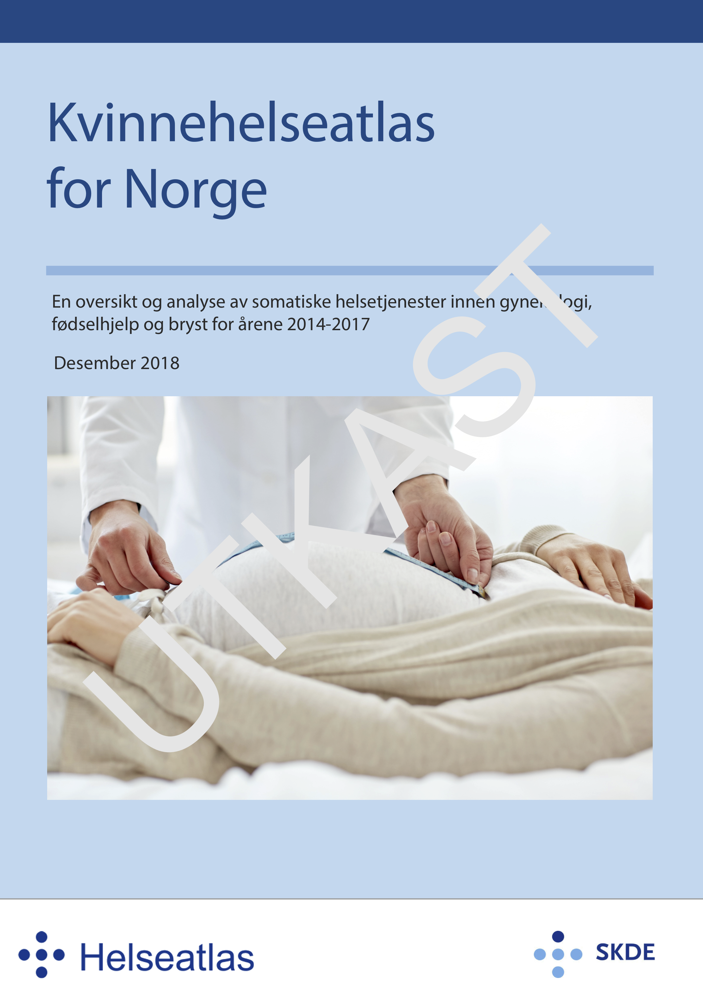
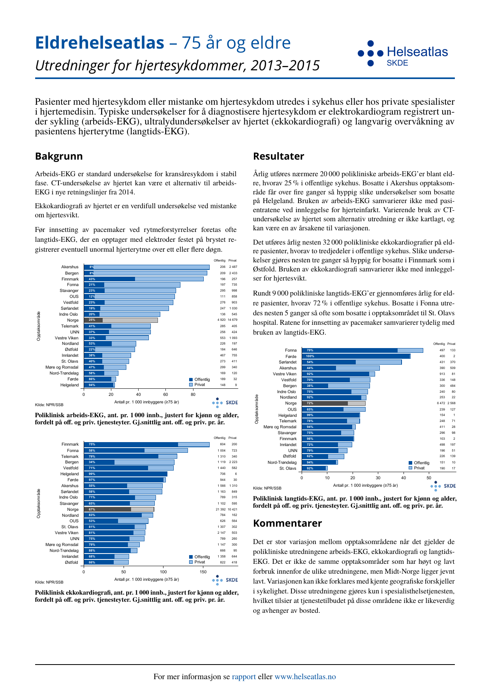

name: blank
layout: true

---
name: front
layout: true
class: center, middle
background-image: url(bg_front_regular.png)

---
template:front

.title[Veien videre]

.subtitle[Planlagte analyser]

---
name: normal
layout: true
class: left
background-image: url(bg_regular.png)

---
name: mfr

background-image: url(bg_regular.png)

# Planlagte analyser, MFR

---
template: mfr

.left-column[
## Fødsler
]

.right-column[
- Totalt 
  &nbsp;&nbsp;starter spontant/med induksjon/med keisersnitt
- Starter med induksjon  
  &nbsp;&nbsp; $\lt$41 uke,  41 uke,  $\gt$41 uke
- Med keisersnitt (uansett start)  
  &nbsp;&nbsp;Akutt/planlagt
- Med epidural 
  &nbsp;&nbsp;Keisersnitt, vaginal
- Assistert vaginal forløsning 
- Sfinkterruptur grad 3 og 4
- Blødning over 500 ml
- Med episiotomi
]

---

template: mfr

.left-column[
## .trans[Fødsler]
## Liggetid
]

.right-column[
- for vaginal fødsel
- for keisersnitt
- for Førstegangsfødende 
- for ikke-førstegangsfødende
]

---

template: mfr

.left-column[
## .trans[Fødsler]
## .trans[Liggetid]
## Annet
]

.right-column[
- Assistert befruktning (antall fødsler), IVF
- Populasjonsbeskrivelse?
]

---

layout: true

background-image: url(bg_regular.png)

# Planlagte analyser, KUHR

---

.right-column[
- Oversikt: Alle X og alle W fra ICPC2
- Kontakter for Postmenopausal blødning (X12)
- Kontakter for Prolaps av kv. kjønnsorgan (X87)
- Infertilitet (W15,Y10)
- Blødningsforstyrrelser (X05?, X06, X07, X08)
- Endometriebiopsi (takst 214c)
- Kontakter ifm svangerskap
- Komplikasjoner/kontakter ifm barseltid
]
---
layout:true
background-image: url(bg_regular.png)

---
class: center, middle

# Hvilke analyser bør droppes?

--

### Velg tre (eller flere) analyser som kan/bør droppes, av de vi har vist resultater for og de planlagte

---

# Andre analyser?

.right-column[
- Vaginal UL?
- Andre gynekologiske undersøkelser?
- Andre aktuelle tilstander?
]
---
template: blank

---
template:front

.title[Veien videre]

.subtitle[Rapport og faktaark]

---

# Rapporten

   

   

   

Inneholder 
<ul>
<li> Sammendrag </li>
<li> Innledning </li>
<li> Metodekapittel </li>
<li> Resultatkapitler </li>
<li> Drøftingskapittel </li>
<li> Oppsummering og konklusjon </li>
</ul>
   

---

# Faktaarkene

   

   
   

   

Ett faktaark pr. fagområde
<ul>
<li> Tre-fire figurer </li>
<li> For folk flest </li>
<li> Bakgrunn, om resultatene, og kommentar </li>
<li> Lages etter at førsteutkastet til rapporten er ferdig </li>
</ul>
   

---
template:front

.title[Veien videre]

.subtitle[Hva vil vi med dere?]

---

# Rapporten

.left-column[

## Hva gjør vi

]

.right-column[

Vi ved SKDE vil skrive store deler av rapporten, inkludert
- Innledning
- Beskrivelse av utvalg
- Beskrivelse av resultater
- Diskusjon
- Konklusjonene
]

---

# Rapporten

.left-column[

## .trans[Hva gjør vi]

## Hva vi håper å få hjelp til

]

.right-column[

- Kvalitetssikre utvalget
- Lese gjennom og vurdere beskrivelsen av utvalget
- Innledende tekst om de ulike fagområder
- Tolkninger av funn i lys av relevant faglitteratur
- Vurdere om det kan foreligge uberettiget variasjon
]

---
template: blank

# Rapporten

.left-column[

## .trans[Hva gjør vi]

## Hva vi håper å få hjelp til

]

.right-column[

- Kvalitetssikre utvalget
- Lese gjennom og vurdere beskrivelsen av utvalget
- Innledende tekst om de ulike fagområder
- Tolkninger av funn i lys av relevant faglitteratur
- Vurdere om det kan foreligge uberettiget variasjon
]

---

template: blank
